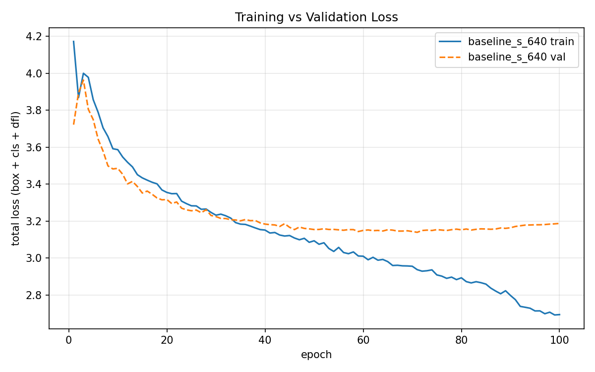
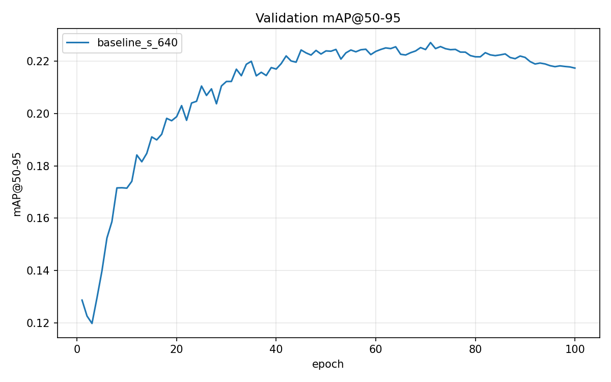

# CMPE 401 Project 1 — Technical Report

> Parts I–II are complete; Parts III–V are filled in as those runs finish. Each
> section maps 1:1 to the required Parts in the project spec. Figures come from
> `results/figures/`, tables from `results/tables/`.

## 0. Overview
- **Team:** <name(s)>
- **Primary model:** YOLOv11 (`yolo11s`, 9.4M parameters, 21.4 GFLOPs)
- **Dataset:** VisDrone-DET (10 classes)
- **Compute:** Google Colab T4 (baseline) + RTX 3060 laptop, 6 GB (pipeline dev, light runs)
- **Repo:** <https://github.com/eijikuinbii/CMPE401-YOLOv11>

### Dataset at a glance
Statistics of the converted YOLO labels (ignored regions and "others" removed):

| Split | Images | Boxes | Boxes / image | Boxes < 32×32 px at 640 input |
|---|---|---|---|---|
| train | 6,471 | 343,204 | 53.0 | 85.3% |
| val | 548 | 38,759 | 70.7 | 85.9% |

The median box covers only ~0.05% of the image (about 14×14 px at 640 input).
Classes are heavily imbalanced in train: car 144,866 and pedestrian 79,337 boxes
versus awning-tricycle 3,246, tricycle 4,812 and bus 5,926.

---

## Part I — Baseline Model
**Settings:** model=`yolo11s` (COCO-pretrained), imgsz=640, batch=16, epochs=100,
optimizer=auto (Ultralytics selected MuSGD, lr0=0.01, lrf=0.01, linear decay),
warmup=3 epochs, mosaic on with `close_mosaic=10`, AMP, seed=0. Trained on a Colab
T4 in three sessions (epochs 1–52, 53–86, 87–100) by resuming from `last.pt`;
the learning-rate schedule continues without a jump across resumes. Total
training time ≈ 4.2 h (~150 s/epoch).

Command:
```bash
python scripts/train.py --model yolo11s.pt --imgsz 640 --batch 16 --epochs 100 --name baseline_s_640
```

Results from `best.pt` (epoch 71), evaluated with `scripts/evaluate.py`:

| Split | mAP@50-95 | mAP@50 | Precision | Recall |
|---|---|---|---|---|
| val | 0.225 | 0.385 | 0.516 | 0.396 |
| test-dev | 0.186 | 0.327 | 0.463 | 0.352 |

(The per-epoch validation during training reports 0.227 mAP@50-95 at epoch 71; the
small difference comes from the standalone evaluation using a different batch size
and padding.)

Per-class mAP@50-95:

| Class | val | test-dev | train boxes |
|---|---|---|---|
| car | 0.544 | 0.456 | 144,866 |
| bus | 0.372 | 0.383 | 5,926 |
| van | 0.293 | 0.247 | 24,956 |
| truck | 0.238 | 0.252 | 12,875 |
| motor | 0.200 | 0.122 | 29,647 |
| pedestrian | 0.192 | 0.110 | 79,337 |
| tricycle | 0.152 | 0.104 | 4,812 |
| people | 0.117 | 0.046 | 27,059 |
| awning-tricycle | 0.085 | 0.105 | 3,246 |
| bicycle | 0.056 | 0.040 | 10,480 |

Inference speed on the T4: ~7.8 ms/img model forward pass (+ ~3 ms pre/post-processing).

Ultralytics' own plots for this run (PR curve, confusion matrix, prediction samples)
are in `results/runs/baseline_s_640/`, which is gitignored; reproduce with the command above.

---

## Part II — Loss Curve & Fitting Analysis





Total loss = box + cls + dfl.

| Epoch | Train loss | Val loss | Gap (val − train) | val mAP@50-95 |
|---|---|---|---|---|
| 1 | 4.172 | 3.722 | −0.450 | 0.129 |
| 40 | 3.152 | 3.184 | 0.032 | 0.217 |
| 71 (best) | 2.937 | **3.139** | 0.202 | **0.227** |
| 90 | 2.798 | 3.164 | 0.366 | 0.222 |
| 100 | 2.694 | 3.188 | 0.493 | 0.217 |

- **Convergence behavior:** In the first epochs, validation loss is *lower* than
  training loss because training images are heavily augmented (mosaic, HSV,
  scale/translate) while validation images are not. The bump at epoch 3 is the end
  of warmup, when the learning rate reaches its peak. From there both losses fall
  together until ~epoch 40. Validation loss then flattens around 3.15, and mAP is
  within 0.005 of its best from epoch 45 on. The model has essentially converged
  on the validation set by the midpoint of the 100-epoch schedule.
- **Overfitting?** Mild, late overfitting. Validation loss reaches its minimum at
  epoch 71 (3.139), which is also the epoch with the best mAP and the source of
  `best.pt`. After that, training loss keeps falling (2.94 → 2.69) while validation
  loss rises slightly (3.14 → 3.19), and the gap grows from 0.20 to 0.49. mAP drops
  only from 0.227 to 0.217, so the overfitting is real but small. The last 10 epochs
  make it clearer: with `close_mosaic=10`, mosaic augmentation is switched off, the
  training images become easier, and training loss drops sharply (2.80 → 2.69). Validation
  loss does not follow; it keeps rising. Without mosaic as a regularizer, the extra
  fit goes into the training set, not into generalization.
- **Underfitting?** Yes, in absolute terms. A validation loss that plateaus at ~3.15
  and a mAP@50-95 of 0.225 show the model cannot represent much of the task: recall
  is only 0.40, so most objects are missed. The fact that training loss keeps
  falling shows the model can still fit the training data. The ceiling is in what
  it can generalize at this resolution and size, not in optimization.
- **Causes — dataset size:** 6,471 training images is small for a 9.4M-parameter
  detector trained for 100 epochs: each image is seen 100 times, which is enough
  for the model to start memorizing image-specific details once the shared
  features are learned (~epoch 70). However, the dataset is dense (53 boxes per
  image, 343k boxes), so the *box* count is large; this is why overfitting stays
  mild rather than severe. The imbalance matters too: car (145k boxes) reaches
  0.54 mAP, while classes with few examples, like awning-tricycle (3.2k) and
  tricycle (4.8k), stay below 0.16. Pedestrian has 79k boxes but still reaches only
  0.19, so object size matters as much as the number of examples (next point).
- **Causes — model capacity:** 85% of boxes are smaller than 32×32 px at 640 input,
  and the median box is ~14×14 px. YOLO11's finest detection head works on a stride-8
  feature map, so a 14-px object covers only about 2×2 cells. `yolo11s` has
  limited width to encode such small, low-detail objects, and downscaling the
  original images (about 1360–2000 px wide) to 640 removes much of the detail before
  the network sees it. Large classes do well (car 0.54, bus 0.37); tiny or similar-looking
  classes do poorly: bicycle 0.06, and people 0.12, which is easily confused with
  pedestrian. This points to underfitting from limited capacity and resolution,
  with mild overfitting layered on top late in training.
- **Implications for the next experiments:**
  - The capacity/resolution limit suggests testing model size (n vs s vs m) and a
    higher `imgsz` (Part III).
  - The late overfitting suggests stronger regularization or keeping augmentation
    on longer (Part IV).

---

## Part III — Structured Experimental Design (≥1 round)
State settings → report quantitative results → analyze. Suggested variables:
model size (n/s/m), image resolution, augmentation, LR schedule, batch, epochs.
Baseline numbers below are val-split metrics from Part I.

| Run | Model | imgsz | batch | epochs | key change | mAP@50-95 | mAP@50 | P | R |
|---|---|---|---|---|---|---|---|---|---|
| baseline | yolo11s | 640 | 16 | 100 | — | 0.225 | 0.385 | 0.516 | 0.396 |
| exp1 | | | | | | | | | |

**Analysis:** <what changed and why>

---

## Part IV — Iterative Model Improvement (≥1 cycle)
Follow: Baseline → Experimental Settings → Controlled Modification → Evaluation
→ Analysis → Conclusion. Examples: regularization, normalization, weight init,
LR schedule, overfitting control.

- **Hypothesis / principle:** <e.g. mosaic+higher weight_decay to curb overfit>
- **Controlled modification:** <exact single change>

| Run | Change | mAP@50-95 | mAP@50 | P | R | Δ vs baseline |
|---|---|---|---|---|---|---|
| baseline | — | 0.225 | 0.385 | 0.516 | 0.396 | — |
| improved | | | | | | |

**Justification & conclusion:** <did it work, and why in DL terms>

---

## Part V — Multi-Version YOLO Comparison (OPTIONAL)
Compare YOLOv11 against ≥1 other version (v8/v9/v10) under a matched recipe.

| Model | mAP@50-95 | mAP@50 | Params (M) | Train time | Inference (ms/img) |
|---|---|---|---|---|---|
| yolo11s | 0.225 | 0.385 | 9.4 | ~4.2 h (T4) | ~7.8 (T4) |
| yolov8s | | | | | |

**Discussion:** <accuracy vs speed vs size trade-offs; confusion matrices>

---

## Reproducibility
Exact commands to reproduce every run above are in the README. Seeds fixed via
`--seed`. Environment: `requirements.txt`.
